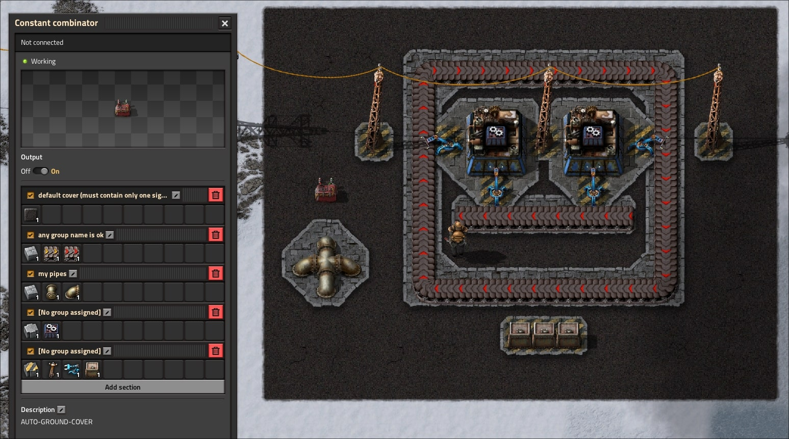

# Auto ground cover

The mod allows you to automatically place ghost tiles under buildings and on any surface.

You can flexibly customize what type of ground coverage will be under what types of buildings, using a constant combinator.

The mod should be compatible with all other modifications that add custom ground coverage, such as the Asphalt mod

> [!WARNING]
> This mod in BETA and can be buggy.

## Hot to use

### Create const combinator

1. Create constant combinator
2. Set "description" to `AUTO-GROUND-COVER`

> [!NOTE]
> You can have different rules on every planet

### Setup rules

Every section of const combinator is **cover group**

Each cover group contains two settings:

- **1** slot = **cover type**
- **2+** slot = **buildings under which this type of ground cover will be**

Signal **quantity** is **border size**, typically you want to have **0** in every signal

> [!NOTE]
> You can turn on/off every group and combinator itself

### Use auto cover select tool

1. Pick tool from quick-bar

2. Select the region to be automatically covered with tiles

This will place tile ghosts for building by bots

### Change or append new rules

You can change or add rules whenever you want, and then you need to select the region to cover again. 

The bots will change coverage automatically

### Turn off default coverage

If you remove or turn off standard coverage, the bots will automatically remove all coverage over which no buildings are built

